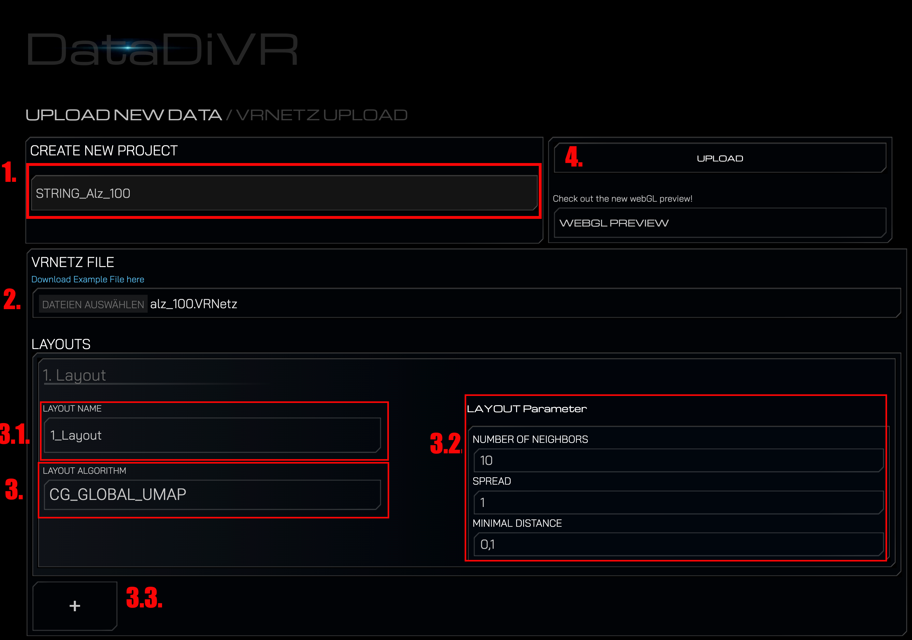
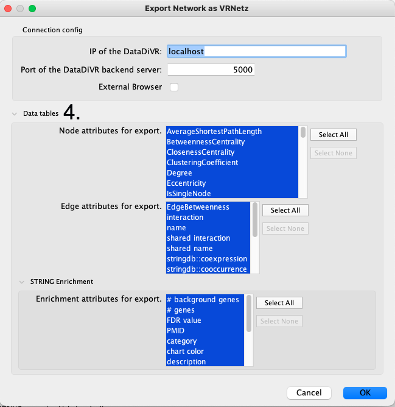

# **CytoDiVR App**

The CytoDiVR App is a [Cytoscape](https://cytoscape.org/) application which is
used to bring Cytoscape networks to Virtual Reality (VR).
The application allows to either:

1. Export any Cytoscape network in a data format which can be uploaded to the
   DataDiVR.
2. Send any Cytoscape network to a running DataDiVR session.

It is planned to provide additional features within the DataDiVR Ecosystem.

Both of these functionalities require to install the [CyEx](https://github.com/ObT1337/CyEx) extension for the DataDiVR which can be found
[here](https://github.com/ObT1337/CyEx).
The CyEx extension also allows to send network from a running DataDiVR
session to Cytoscape. This enables the analysis of a reduced network with the
broad tool set provided by Cytoscape. For this functionality the Cytoscape
application [cyREST](https://apps.cytoscape.org/apps/cyrest) has to be installed.
However, this application is already included in every Cytoscape installation
starting with v3.3.

---

## **Resources**

###  - Direct download of the [DataDiVR-App](https://github.com/menchelab/CytoDiVR/blob/main/target/CytoDiVR-1.0.1.jar)
### - Repo of the [CyEx](https://github.com/ObT1337/CyEx) extension

---

## **Content**

1. [**Installation of the CytoDiVR**](#App_install) 
2. [**Installation of the CyEx extension**](#Ex_install) 
3. [**Usage of the CytoDiVR**](#App_usage) 

<!--3. [**Upload a STRING network**](#upload_string) 
1. [**Upload an arbitrary VRNetz**](#upload_network) 
2. [**Map string network on preprocessed PPI**](#map_network) 
3. [**Dependencies**](#Dependencies) 
4. [**License**](#License)  -->

---

<h3 id="App_install"><b>1. Installation of the CytoDiVR App</b></h3>

1. Download the latest release of the CytoDiVR Cytoscape App here: [CytoDiVR App](https://github.com/menchelab/CytoDiVR/blob/main/target/CytoDiVR-1.0.1.jar)
   
2. install the Cytoscape application using the AppManager of Cytoscape. In Cytoscape navigate to:

`Apps -> App Manger -> Install from File... -> select the "CytoDiVR-x.x.x.jar" file.`

3. Select the file you downloaded in step 1.

---

<h3 id="Ex_install"><b> 2. Installation of the CyEx Extensions </b></h3>

To make use of the application it is necessary to install the `CyEx` extension. Please be sure to use the `dev` branch for both the `CyEx`extension, aswell as for the `DataDiVR_WebApp`.

For the installation of this extension, please refer to the respective rep: [CyEx](https://github.com/ObT1337/CyEx)

<h3 id="App_usage"><b> 3. Usage of the CytoDiVR App </b></h3>

<h4> Export a network as VRNetz </h4>

1. Select a network you would like to export.
2. Export the selected network as an "VRNetz" via:

   a) Apps -> CytoDiVR -> Export network as VRNetz

   or

   b) File -> Export -> Export network as VRNetz

3. Select the location where to save the network, as well as a name in the prompted window.
   
   (3.1. When needed you can select only the link and node column you want to export.
   By default all link and node columns are exported.)

4. Click "Ok" and the network is exported.

You network is now exported as an VRNetz which can be used in the
[DataDiVR](https://github.com/menchelab/DataDiVR_WebApp) to present your network
as a 3D network. When the `CyEx` extension in installed you can navigate to 

- http://localhost:5000/CyEx/upload (Backend runs on Win/Linux)
- http://localhost:3000/CyEx/upload (Backend runs on Mac)

Here you have to do the following steps:
1. Give your project a name to later identify your project.
2. Select the `VRNetz` file you exported with the CytoDiVR Cytoscape App
3. Select a layout algorithm that should be used to create a three-dimensional layout for the representation in VR.

   3.1. Give you layout a name so you can later identify the respective layout.

   3.2. Change the layout variables to your desire.

   3.3. You can also add additional layouts that should be calculated during the upload.
   This allows you to test different layouts.

4. Click `UPLOAD` to upload the network.

<h4> Send a network to the DataDiVR </h4>

1. Select a network you would like to send.

2. Send the selected network to the DataDiVR via: 
   `-> Apps -> CytoDiVR -> Send network to DataDiVR`
    

3. Define the address of you DataDiVR backend:

   3.1. If the DataDiVR is not running on your local machine or on a different port than 5000, you can change the IP and port.

4. When needed you can select only the link and node column you want to send. By default all link and node columns are sent. For exclude certain node or link column, you can expand the `Data tables` and select the column and links you want to be included in your network.

5. Click "Ok" the network data is send to you DataDiVR backend and a Web browser opens with the same interface described above. As the data is already send to the server you do not have to provide a VRNetz file but you still have to do step 1 and 3.
   
   

---

<!--
---

<h3 id="upload_string"><b> 4. Upload a Network from Cytoscape</b></h3>

1. Export a STRING network with the VRNetzerApp from Cytoscape ([see above](#App_usage))

2. Start the VRNetzer backend using the script applicable to your operating system.

3. Navigate in your Browser to http://127.0.0.1:5000/upload (Windows/Linux) / http://127.0.0.1:3000/upload (mac)

4. If the StringEx is correctly installed, you should now see two new tabs. The first is the a VRNetz designated uploader

   

5. On this tab, define a project name, select the VRNetz file of your exported String network, and select the desired layout algorithm.

6. You can also define the respective layout variables.

7. Click on the "Upload" button to upload the network to the VRNetzer platform.

8. If the upload was successful, you'll be prompted with a success message and a link to preview the project in the designated WebGL previewer.

---

<h3 id="map_network"><b>5. Map an exported network on a preprocessed PPI</b></h3>

Do the first three steps as mentioned [above](#upload_string).

1. The second tab is the STRING mapper.

   

2. On this tab, define a project name, select the VRNetz file of your exported String network, and select the organism from which your VRNetz originates of.

3. Click on the "Map" button to map the network with the preprocessed PPI.
4. If the upload was successful, you'll be prompted with a success message and a link to preview the project in the designated WebGL previewer.

--- -->

## **Dependencies**

<!-- [Cytoscape - StringApp](https://apps.cytoscape.org/apps/stringapp) -->

<!-- [Cytoscape - VRNetzerApp](https://github.com/menchelab/STRING-VRNetzer/blob/main/VRNetzerApp/target/VRNetzerApp-1.0.0.jar) -->

<!-- [VRNetzer - StringEx](https://github.com/menchelab/StringEx) -->

[CyEx - A DataDiVR extension](https://github.com/ObT1337/CyEx)
---

## **Used software**

[DataDiVR WebApp](https://github.com/menchelab/DataDiVR_WebApp)

[DataDiVR VR Module](https://ucloud.univie.ac.at/index.php/s/kUNbOhrn8Bsl50d)

[Cytoscape v3.8. ++](https://cytoscape.org/)

---

## **Future plans**

This application is planned to be extended with other functionalities that increase the user experience for both Cytoscape user as well as DataDiVR user.

## **License**

Copyright (c) 2022 Menche Lab

This project is licensed under the terms of the MIT license. Check the
LICENSE.md file for details.
